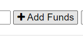

# Budget Tracker

## Description

A budget tracking application.

## Usage

* Go to https://secret-oasis-09073.herokuapp.com/index.html 

* If you are using chrome on windows and would like to install you can click the link on the address bar.

* To add a transaction simply add the name of the transaction.

* Then add the transaction amount.

* If you wish to add funds click the add funds button.

* If you wish to subtract funds click the subtract funds button.

* Add as many transactions as needed. (even works offline)

# Contributing

* Jonathan Faulkner
added offline functionality

# Links
[Github](https://github.com/JonnyFaulkner/budget-tracker)
[Heroku](https://secret-oasis-09073.herokuapp.com/index.html)

